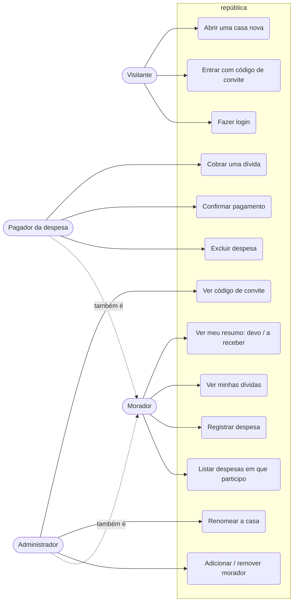
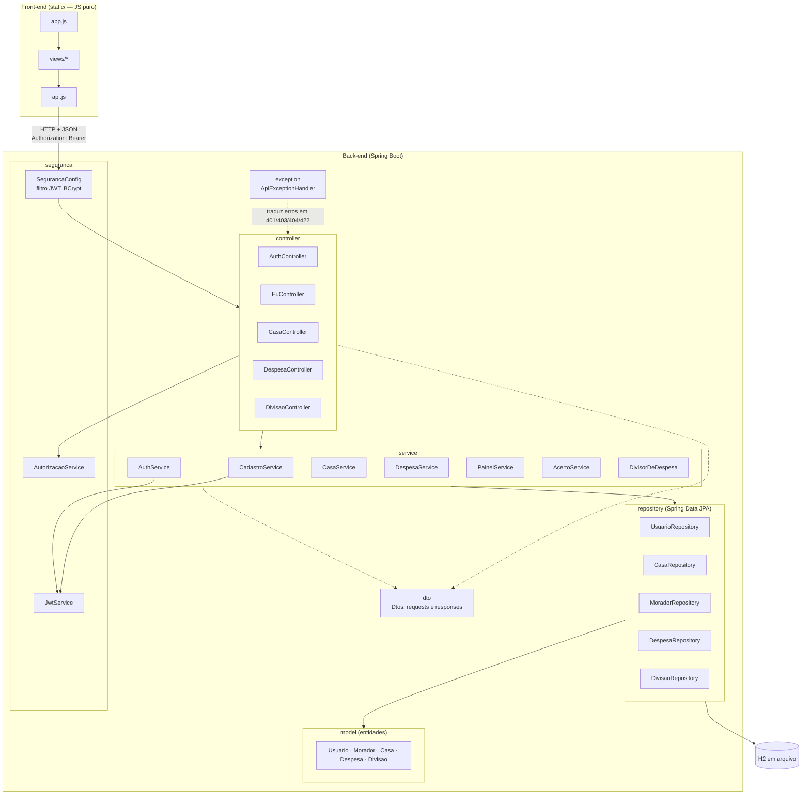
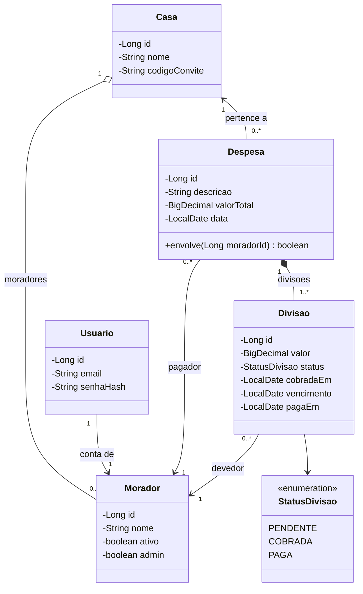
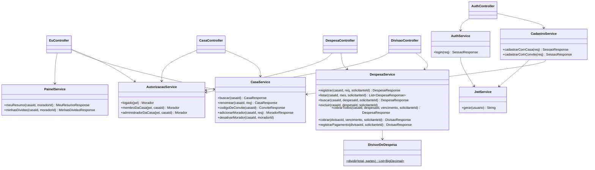
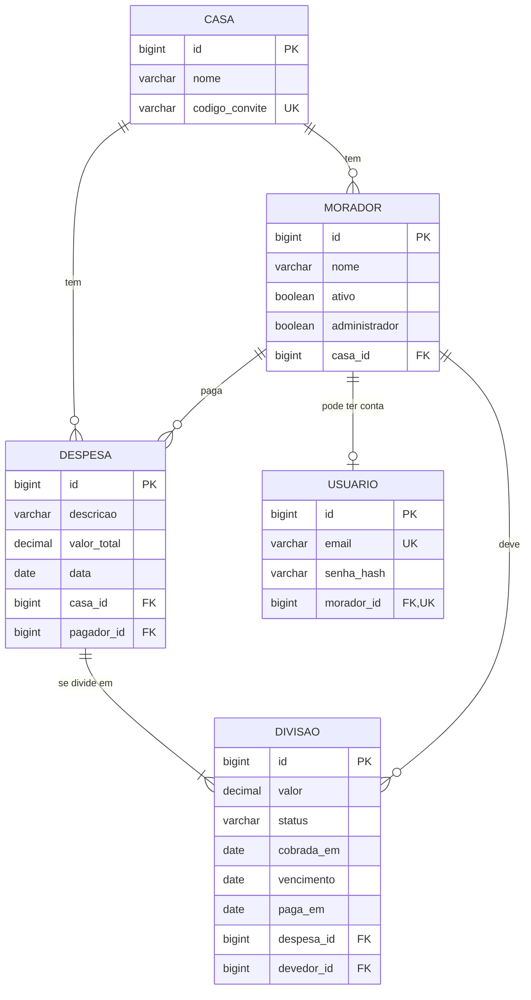
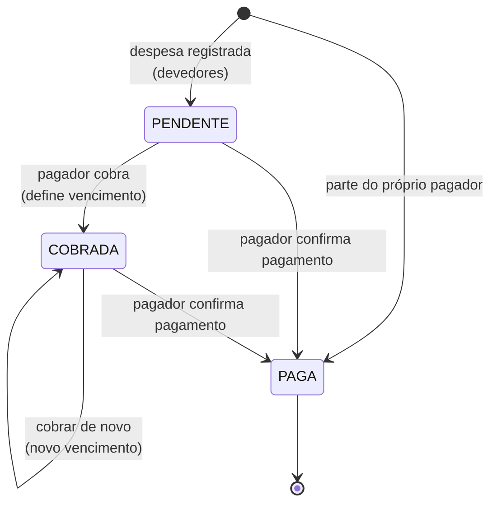
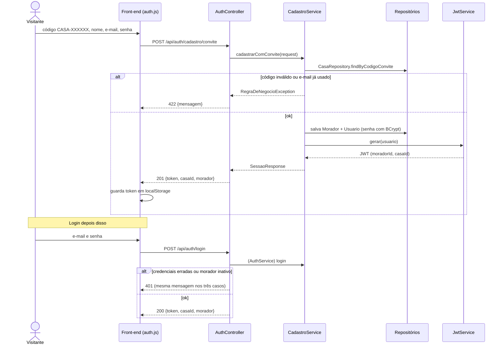
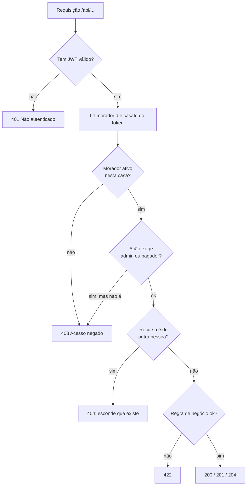

# Documentação UML — república

Diagramas escritos em [Mermaid](https://mermaid.js.org/): o GitHub e o IntelliJ (plugin *Mermaid*) desenham tudo direto deste arquivo.
Eles descrevem o código da branch `feature/login`.

Índice: 1. Casos de uso · 2. Arquitetura em camadas · 3. Classes do domínio · 4. Banco de dados (ER) · 5. Estados da dívida · 6. Sequência: login e cadastro · 7. Sequência: registrar e cobrar uma despesa · 8. Segurança por requisição

---

## 1. Casos de uso



Quem registra a despesa é sempre o pagador, e só ele cobra, confirma pagamento ou exclui.

---

## 2. Arquitetura em camadas



Regra de dependência: o controller nunca fala com repositório; o serviço nunca conhece HTTP. A identidade vem do token, nunca de um id na URL.

---

## 3. Diagrama de classes (domínio)



- `Despesa` e `Divisao` formam uma composição (cascade + orphanRemoval): apagar a despesa apaga as divisões.
- Um morador pode existir **sem** `Usuario` (morador cadastrado pelo admin, sem conta).
- A parte do próprio pagador entra como `Divisao` já `PAGA`.

### Serviços e segurança (classes principais)



---

## 4. Banco de dados (modelo entidade-relacionamento)



---

## 5. Estados de uma dívida (`Divisao.status`)



Uma dívida COBRADA com vencimento no passado aparece como **atrasada** (calculado na resposta, não é um status guardado).

---

## 6. Sequência: cadastro com convite e login



---

## 7. Sequência: registrar e cobrar uma despesa

```mermaid
sequenceDiagram
    actor P as Pagador (logado)
    actor D as Devedor
    participant F as Front-end
    participant DC as DespesaController
    participant A as AutorizacaoService
    participant DS as DespesaService
    participant Div as DivisorDeDespesa
    participant R as Repositórios

    P->>F: descrição, valor, data, participantes
    F->>DC: POST /api/casas/{id}/despesas (Bearer token)
    DC->>A: membroDaCasa(jwt, casaId)
    A-->>DC: Morador logado
    DC->>DS: registrar(casaId, request, solicitanteId)
    DS->>Div: dividir(valorTotal, nParticipantes)
    Div-->>DS: partes em centavos (resto distribuído)
    DS->>R: salva Despesa + Divisoes (PENDENTE; a do pagador já PAGA)
    DS-->>DC: DespesaResponse
    DC-->>F: 201

    P->>F: "Cobrar" com vencimento
    F->>DC: POST /api/divisoes/{id}/cobranca
    DC->>DS: cobrar(divisaoId, vencimento, solicitanteId)
    DS->>DS: exigirPagador (senão 403)
    DS->>R: status = COBRADA
    DS-->>F: DivisaoResponse

    D->>F: abre "Minha visão"
    F->>F: GET /api/eu/dividas
    Note right of D: só vê dívidas em que participa

    P->>F: confirma que recebeu
    F->>DC: POST /api/divisoes/{id}/pagamento
    DS->>R: status = PAGA, pagaEm = hoje
```

---

## 8. Segurança por requisição



Os arquivos estáticos (`/`, `/js`, `/css`), o Swagger e o H2 console ficam liberados (`permitAll`); todo o resto exige token.
